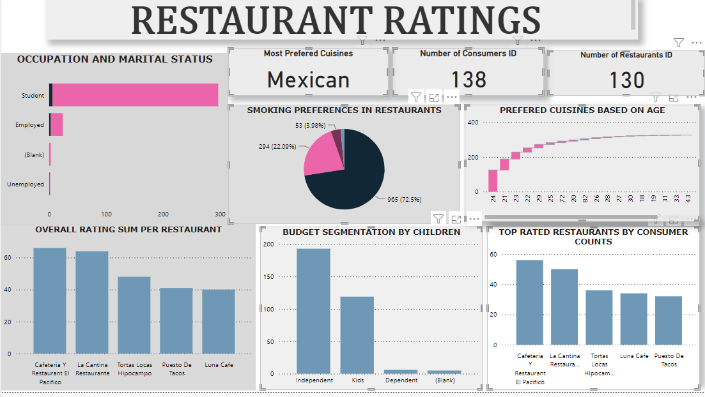

# RESTAURANT RATING ANALYSIS
## INTRODUCTION
This is a power BI project on analysis of a data set called the restaurant rating dataset which contains information about restaurants in
mexico. A customer survey was carried out in this city in 2012 to collate information about each
restaurant, their cuisines, information about their consumers and the preferences of the consumers.
There are other additional information you will find in this dataset when exploring it.

## PROBLEM STATEMENT

1. What can you learn from the highest rated restaurants? Do consumer preferences have an effect on
ratings?
2. What are the consumer demographics? Does this indicate a bias in the data sample?
3. Are there any demand & supply gaps that you can exploit in the market?
4. If you were to invest in a restaurant, which characteristics would you be looking for?

## SKILLS
The following power BI features were incorporated;
Quick measures, filters, page navigation

## VISUALIZATION
This report comprises 2 pages

## ANALYSIS
There are a total of 130 restaurants that were rated with 138 consumers.🤓
The highest rated restaurant is Cafeteria Y El Pacifico.
The most preferred cuisine is Mexican cuisine.
Majority of the customers are students.

## RECOMMENDATIONS
Studying the cafeteria Y strategies will help other restaurants pick up.
